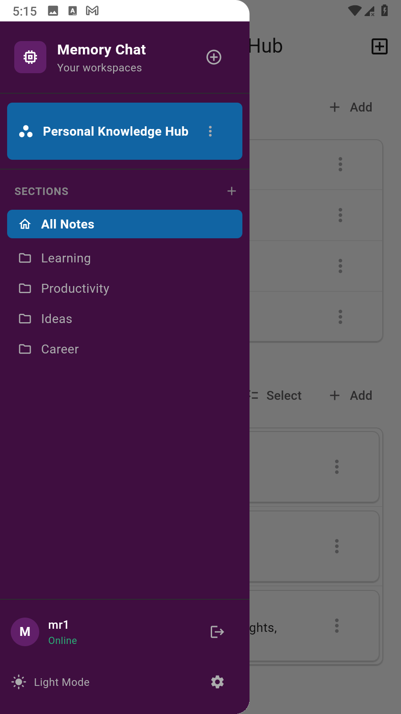
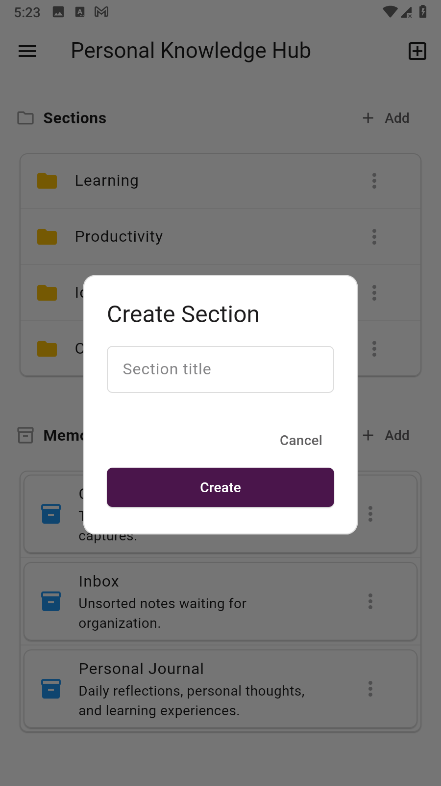
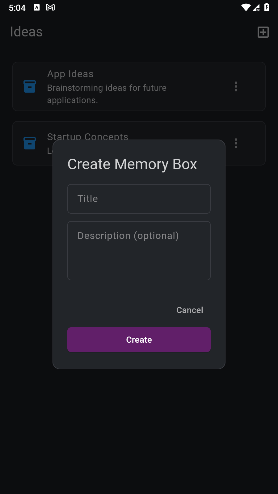
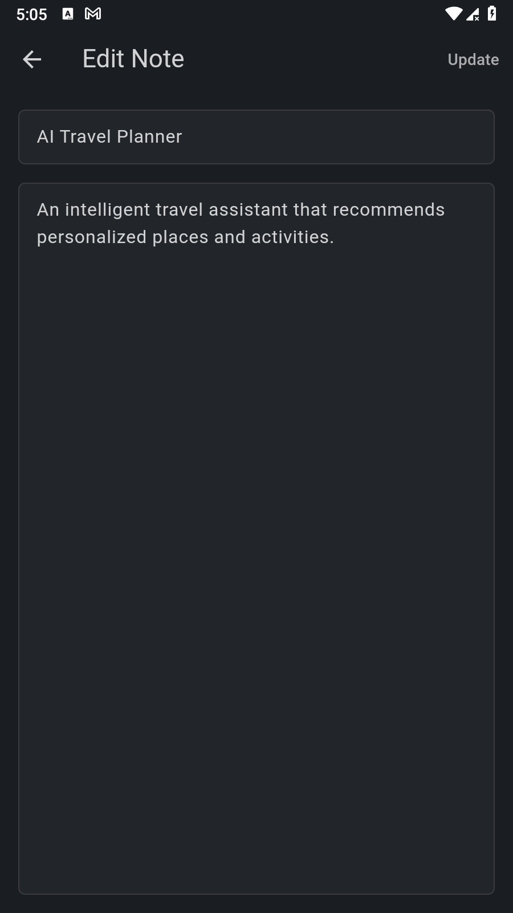
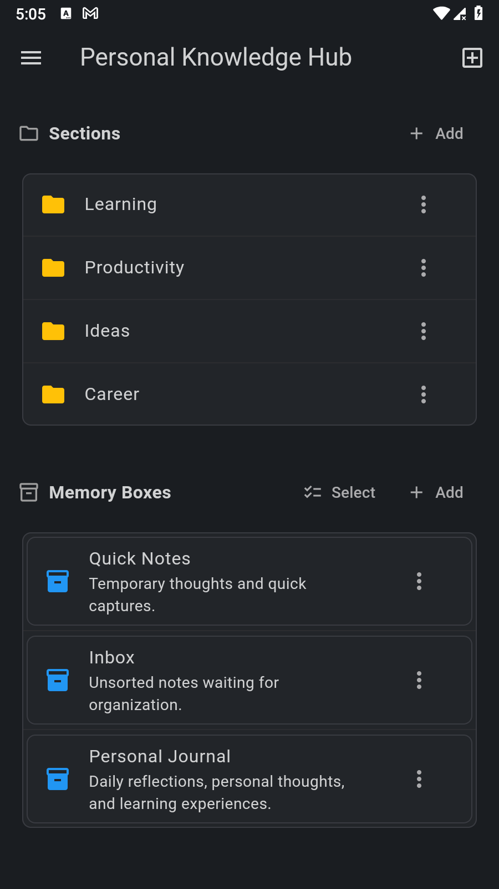

# 🧠 Memory Chat – Offline-First Collaborative Note-Taking Platform

A production-grade **offline-first** mobile application built with Flutter, featuring real-time synchronization across devices, hierarchical knowledge organization, and a Slack-inspired responsive UI.

Built with **Clean Architecture**, **PowerSync**, **Supabase**, **Drift**, and **BLoC (Cubit)** state management.

---

## 📸 Screenshots

<p align="center">
  
  
  
  
</p>
<p align="center">
  
  
  
  
</p>

---

## ✨ Features

### 🔄 Offline-First Architecture
- **Local-first data storage** – All operations work instantly without internet
- **Automatic synchronization** – Changes sync to Supabase when online
- **Zero data loss** – Local queue ensures no operation is ever lost
- **Conflict resolution** – PowerSync handles concurrent edits gracefully
- **Seamless offline experience** – Full CRUD operations work offline

### 📁 Hierarchical Organization
- **Workspaces** – Top-level containers for different projects/contexts
- **Sections** – Organize content within workspaces (like Slack channels)
- **Memory Boxes** – Group related notes together
- **Notes** – Rich text notes with title and content
- **Flexible navigation** – Move items between sections/workspaces

### 🎨 Slack-Inspired Responsive UI
- **Desktop/Tablet** – Persistent sidebar with workspaces and sections
- **Mobile** – Collapsible drawer navigation
- **Adaptive layout** – Automatically switches based on screen size
- **Light/Dark Theme** – System-aware with manual override
- **Real-time updates** – UI reflects changes instantly via Streams

### 👥 Multi-User Collaboration
- **Supabase Authentication** – Secure email/password login
- **Row Level Security (RLS)** – Data isolation between users
- **Workspace sharing** – Invite members to collaborate
- **Role-based access** – Owner/Member permissions

### 🔐 Security & Privacy
- **JWT-based authentication** with Supabase
- **Row Level Security (RLS)** policies on all tables
- **Environment variables** for sensitive configuration
- **Secure local storage** for credentials

### 📱 Smart Features
- **Real-time sync status** – Visual indicators for sync state
- **Pull-to-refresh** – Manual refresh on all lists
- **Empty states** – Beautiful placeholders with CTAs
- **Loading indicators** – Smooth UX during operations
- **Error handling** – User-friendly error messages
- **Confirmation dialogs** – Prevent accidental deletions

---

## 🏗️ Architecture

```
Clean Architecture + Feature-Based Structure + Offline-First
```

```
lib/
├── app/
│   ├── di/                      # Dependency Injection (GetIt)
│   ├── router/                  # GoRouter configuration
│   └── theme/                   # AppTheme + AppColors (Light/Dark)
│
├── core/
│   ├── constants/               # Env keys, DB constants
│   ├── database/                # Drift database + DAOs + Tables
│   │   ├── daos/               # Data Access Objects
│   │   ├── tables/             # Table definitions
│   │   └── mappers/            # Entity ↔ Row mappers
│   ├── services/               # Supabase service
│   ├── sync/                   # PowerSync service + connector
│   └── utils/                  # ID generator, validators
│
├── features/
│   ├── auth/                   # Authentication (Login/Signup)
│   │   ├── data/              # Remote data source + repository
│   │   ├── domain/            # Entities + Use cases
│   │   └── presentation/      # Cubits + Pages
│   │
│   ├── workspaces/            # Workspace management
│   │   ├── data/
│   │   ├── domain/
│   │   └── presentation/
│   │
│   ├── sections/              # Section management
│   ├── memory_boxes/          # Memory Box management
│   └── notes/                 # Note CRUD + Editor
│
├── shared/
│   ├── dialogs/               # Reusable dialogs
│   └── widgets/               # Shared UI components
│       ├── app_layout.dart    # Responsive layout (Sidebar/Drawer)
│       └── app_sidebar.dart   # Slack-style sidebar
│
└── main.dart                  # App entry + initialization
```

---

## 🛠️ Tech Stack

| Technology | Usage |
|-----------|-------|
| **Flutter** | Cross-platform UI framework |
| **Dart** | Programming language |
| **PowerSync** | Offline-first sync engine |
| **Supabase** | Backend (Auth + Database + RLS) |
| **Drift** | Type-safe SQLite ORM |
| **Bloc / Cubit** | State management |
| **GoRouter** | Declarative navigation |
| **GetIt** | Dependency injection |
| **flutter_dotenv** | Environment variables |
| **Equatable** | Value equality |
| **UUID** | Unique ID generation |
| **Path Provider** | File system access |

---

## 🚀 Getting Started

### Prerequisites
- Flutter SDK (3.11.5+)
- Supabase account
- PowerSync account
- Android Studio / VS Code

### Installation

```bash
# Clone the repository
git clone https://github.com/Mo7medRef3t/memory-chat.git

# Navigate to project
cd memory-chat

# Install dependencies
flutter pub get

# Generate Drift files
dart run build_runner build --delete-conflicting-outputs

# Create .env file
cp .env.example .env
# Add your Supabase and PowerSync credentials

# Run the app
flutter run
```

### Environment Setup

Create a `.env` file in the root directory:

```env
SUPABASE_URL=your_supabase_url
SUPABASE_ANON_KEY=your_supabase_anon_key
POWERSYNC_URL=your_powersync_url
```

---

## 🗄️ Backend Setup

### Supabase Configuration

1. **Create a Supabase project** at [supabase.com](https://supabase.com)

2. **Create tables** in SQL Editor:

```sql
-- Profiles table
CREATE TABLE profiles (
  id UUID PRIMARY KEY REFERENCES auth.users(id),
  email TEXT,
  full_name TEXT,
  avatar_url TEXT,
  created_at TIMESTAMP DEFAULT NOW(),
  updated_at TIMESTAMP DEFAULT NOW()
);

-- Workspaces table
CREATE TABLE workspaces (
  id UUID PRIMARY KEY DEFAULT gen_random_uuid(),
  name TEXT NOT NULL,
  description TEXT,
  owner_id UUID REFERENCES profiles(id),
  created_at TIMESTAMP DEFAULT NOW(),
  updated_at TIMESTAMP DEFAULT NOW()
);

-- Workspace members table
CREATE TABLE workspace_members (
  id UUID PRIMARY KEY DEFAULT gen_random_uuid(),
  workspace_id UUID REFERENCES workspaces(id) ON DELETE CASCADE,
  user_id UUID REFERENCES profiles(id),
  role TEXT DEFAULT 'member',
  joined_at TIMESTAMP DEFAULT NOW(),
  UNIQUE(workspace_id, user_id)
);

-- Sections table
CREATE TABLE sections (
  id UUID PRIMARY KEY DEFAULT gen_random_uuid(),
  workspace_id UUID REFERENCES workspaces(id) ON DELETE CASCADE,
  title TEXT NOT NULL,
  created_at TIMESTAMP DEFAULT NOW(),
  updated_at TIMESTAMP DEFAULT NOW()
);

-- Memory boxes table
CREATE TABLE memory_boxes (
  id UUID PRIMARY KEY DEFAULT gen_random_uuid(),
  workspace_id UUID REFERENCES workspaces(id) ON DELETE CASCADE,
  section_id UUID REFERENCES sections(id) ON DELETE SET NULL,
  title TEXT NOT NULL,
  description TEXT,
  created_at TIMESTAMP DEFAULT NOW(),
  updated_at TIMESTAMP DEFAULT NOW()
);

-- Notes table
CREATE TABLE notes (
  id UUID PRIMARY KEY DEFAULT gen_random_uuid(),
  memory_box_id UUID REFERENCES memory_boxes(id) ON DELETE CASCADE,
  author_id UUID REFERENCES profiles(id),
  title TEXT NOT NULL,
  content TEXT,
  created_at TIMESTAMP DEFAULT NOW(),
  updated_at TIMESTAMP DEFAULT NOW()
);
```

3. **Enable Row Level Security (RLS)** and create policies:

```sql
-- Enable RLS on all tables
ALTER TABLE profiles ENABLE ROW LEVEL SECURITY;
ALTER TABLE workspaces ENABLE ROW LEVEL SECURITY;
ALTER TABLE workspace_members ENABLE ROW LEVEL SECURITY;
ALTER TABLE sections ENABLE ROW LEVEL SECURITY;
ALTER TABLE memory_boxes ENABLE ROW LEVEL SECURITY;
ALTER TABLE notes ENABLE ROW LEVEL SECURITY;

-- Example policies for notes
CREATE POLICY "Users can view notes in their workspaces"
ON notes FOR SELECT
USING (
  memory_box_id IN (
    SELECT mb.id FROM memory_boxes mb
    WHERE mb.workspace_id IN (
      SELECT workspace_id FROM workspace_members
      WHERE user_id = auth.uid()
    )
  )
);

CREATE POLICY "Users can create notes in their workspaces"
ON notes FOR INSERT
WITH CHECK (
  memory_box_id IN (
    SELECT mb.id FROM memory_boxes mb
    WHERE mb.workspace_id IN (
      SELECT workspace_id FROM workspace_members
      WHERE user_id = auth.uid()
    )
  )
);

-- Add similar policies for UPDATE and DELETE
```

### PowerSync Configuration

1. **Create a PowerSync instance** at [powersync.com](https://powersync.com)

2. **Connect to Supabase** in PowerSync dashboard

3. **Configure Sync Rules**:

```yaml
config:
  edition: 3

streams:
  user_data:
    auto_subscribe: true
    queries:
      - SELECT * FROM profiles
      - SELECT * FROM workspace_members
      - SELECT * FROM workspaces
      - SELECT * FROM sections
      - SELECT * FROM memory_boxes
      - SELECT * FROM notes
```

4. **Deploy sync rules**

---

## 🔄 Offline-First Flow

```
┌─────────────┐
│   UI Layer  │
│  (Flutter)  │
└──────┬──────┘
       │
       ▼
┌─────────────┐
│   Cubits    │
│  (BLoC)     │
└──────┬──────┘
       │
       ▼
┌─────────────┐
│ Repository  │
│   Layer     │
└──────┬──────┘
       │
       ▼
┌─────────────────────────────────────┐
│      PowerSync Local Database       │
│      (SQLite via Drift ORM)         │
└──────┬──────────────────────┬───────┘
       │                      │
       ▼                      ▼
┌─────────────┐        ┌─────────────┐
│   Upload    │        │  Download   │
│   Queue     │        │   Stream    │
└──────┬──────┘        └──────┬──────┘
       │                      │
       ▼                      ▼
┌─────────────────────────────────────┐
│      Supabase Backend               │
│   (PostgreSQL + Auth + RLS)         │
└─────────────────────────────────────┘
```

### How It Works:

1. **Write Operation**: User creates/updates/deletes data
2. **Local Save**: Data saved to PowerSync local SQLite instantly
3. **UI Update**: UI reflects change immediately via Streams
4. **Upload Queue**: Change added to upload queue
5. **Background Sync**: PowerSync uploads to Supabase when online
6. **Download Stream**: Changes from other devices sync down
7. **Conflict Resolution**: PowerSync handles conflicts automatically

---

## 🎯 Key Technical Highlights

### Offline-First Architecture
- **Local-first writes** – All operations save locally first
- **Automatic sync** – Background synchronization when online
- **Upload queue** – Pending operations persist across app restarts
- **Conflict resolution** – Automatic handling of concurrent edits
- **Zero data loss** – Guaranteed delivery with retry logic

### Real-time Synchronization
- **PowerSync integration** – Bidirectional sync engine
- **Supabase Realtime** – Instant updates across devices
- **Stream-based UI** – Reactive updates via Dart Streams
- **Checkpoint management** – Efficient delta sync

### Type-Safe Database
- **Drift ORM** – Compile-time SQL validation
- **Code generation** – Type-safe queries and migrations
- **DAO pattern** – Clean separation of data access logic
- **Entity mappers** – Clean domain model separation

### Responsive Design
- **Adaptive layout** – Sidebar on desktop, drawer on mobile
- **Breakpoint-based** – 600px threshold for mobile/desktop
- **Consistent UX** – Same features across all screen sizes
- **Slack-inspired** – Familiar navigation pattern

### Security
- **Row Level Security** – Database-level data isolation
- **JWT authentication** – Secure token-based auth
- **Environment variables** – No hardcoded secrets
- **RLS policies** – Granular access control

### Clean Architecture
- **Feature-based structure** – Organized by business domain
- **Dependency injection** – GetIt for loose coupling
- **Repository pattern** – Abstract data sources
- **Use cases** – Business logic separation
- **Testable code** – Easy to unit test each layer

---

## 🧪 Testing

### Unit Tests
- Repository layer tests
- Use case tests
- Entity mapper tests

### Integration Tests
- PowerSync sync tests
- Supabase integration tests
- Offline/online transition tests

### Manual Testing Scenarios
- ✅ Create workspace offline → sync when online
- ✅ Edit note on device A → appears on device B
- ✅ Delete section → cascades to memory boxes and notes
- ✅ Move memory box between sections
- ✅ Multi-user collaboration with RLS

---

## 📊 Database Schema

```
┌──────────────┐
│   profiles   │
├──────────────┤
│ id (PK)      │
│ email        │
│ full_name    │
│ avatar_url   │
│ created_at   │
│ updated_at   │
└──────────────┘
         │
         │ owner_id
         ▼
┌──────────────┐       ┌────────────────────┐
│  workspaces  │◄──────│ workspace_members  │
├──────────────┤       ├────────────────────┤
│ id (PK)      │       │ id (PK)            │
│ name         │       │ workspace_id (FK)  │
│ description  │       │ user_id (FK)       │
│ owner_id(FK) │       │ role               │
│ created_at   │       │ joined_at          │
│ updated_at   │       └────────────────────┘
└──────────────┘
         │
         │ workspace_id
         ▼
┌──────────────┐
│   sections   │
├──────────────┤
│ id (PK)      │
│ workspace_id │
│ title        │
│ created_at   │
│ updated_at   │
└──────────────┘
         │
         │ section_id (nullable)
         ▼
┌────────────────┐
│ memory_boxes   │
├────────────────┤
│ id (PK)        │
│ workspace_id   │
│ section_id     │
│ title          │
│ description    │
│ created_at     │
│ updated_at     │
└────────────────┘
         │
         │ memory_box_id
         ▼
┌──────────────┐
│    notes     │
├──────────────┤
│ id (PK)      │
│ memory_box_id│
│ author_id    │
│ title        │
│ content      │
│ created_at   │
│ updated_at   │
└──────────────┘
```

---

## 🔧 Development Commands

```bash
# Install dependencies
flutter pub get

# Generate Drift files
dart run build_runner build --delete-conflicting-outputs

# Watch mode for development
dart run build_runner watch --delete-conflicting-outputs

# Run tests
flutter test

# Build APK
flutter build apk --release

# Build iOS
flutter build ios --release

# Clean build
flutter clean
flutter pub get
dart run build_runner build --delete-conflicting-outputs
```

---

## 📱 App Flow

```
┌─────────┐
│  Login  │
└────┬────┘
     │
     ▼
┌──────────────┐
│ Workspaces   │◄───────┐
│   List       │        │
└──────┬───────┘        │
       │                │
       ▼                │
┌──────────────┐        │
│  Workspace   │        │
│   Details    │        │
│ (Sections +  │        │
│ Root Boxes)  │        │
└──────┬───────┘        │
       │                │
       ├────────────────┤
       │                │
       ▼                ▼
┌──────────────┐  ┌──────────────┐
│   Section    │  │ Memory Box   │
│   Details    │  │   Details    │
│ (Boxes)      │  │  (Notes)     │
└──────┬───────┘  └──────┬───────┘
       │                 │
       ▼                 ▼
┌──────────────┐  ┌──────────────┐
│ Memory Box   │  │    Notes     │
│   Details    │  │     List     │
│  (Notes)     │  └──────┬───────┘
└──────┬───────┘         │
       │                 │
       └────────┬────────┘
                │
                ▼
         ┌──────────────┐
         │ Note Editor  │
         │ (Create/Edit)│
         └──────────────┘
```

---

## 🎨 UI Components

### Shared Widgets
- `AppLayout` – Responsive layout (Sidebar/Drawer)
- `AppSidebar` – Slack-style navigation sidebar
- `AppTextField` – Styled text input
- `PrimaryButton` – Reusable button component
- `LoadingIndicator` – Loading spinner
- `EmptyStateCard` – Empty state placeholder

### Dialogs
- `CreateWorkspaceDialog`
- `CreateSectionDialog`
- `CreateMemoryBoxDialog`
- `DeleteConfirmationDialog`
- `EditMemoryBoxDialog`
- `MoveMemoryBoxDialog`

---

## 🚀 Future Enhancements

- [ ] Rich text editor for notes (Markdown support)
- [ ] File attachments in notes
- [ ] Real-time collaboration (multi-user editing)
- [ ] Search functionality across all content
- [ ] Tags and labels for organization
- [ ] Export notes to PDF/Markdown
- [ ] Mobile widgets (iOS/Android)
- [ ] Push notifications for mentions
- [ ] Workspace templates
- [ ] Import from Notion/Evernote

---

## 📄 License

This project is open source and available under the [MIT License](LICENSE).

---

## 🤝 Contributing

Contributions, issues, and feature requests are welcome!

1. Fork the project
2. Create your feature branch (`git checkout -b feature/AmazingFeature`)
3. Commit your changes (`git commit -m 'Add some AmazingFeature'`)
4. Push to the branch (`git push origin feature/AmazingFeature`)
5. Open a Pull Request

---

## 📧 Contact

**Mohamed Refaat** – [@Mo7medRef3t](https://github.com/Mo7medRef3t)

Project Link: [https://github.com/Mo7medRef3t/memory-chat](https://github.com/Mo7medRef3t/memory-chat)

---

<p align="center">
  Built with ❤️ using Flutter, PowerSync & Supabase
</p>

<p align="center">
  <a href="https://flutter.dev">
    
  </a>
  <a href="https://dart.dev">
    
  </a>
  <a href="https://supabase.com">
    
  </a>
  <a href="https://www.powersync.com">
    
  </a>
</p>
```